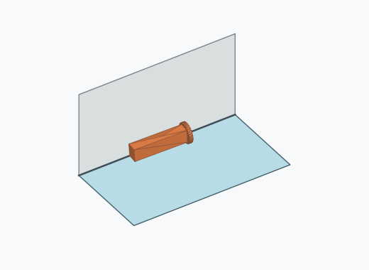
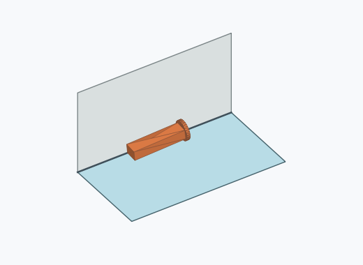
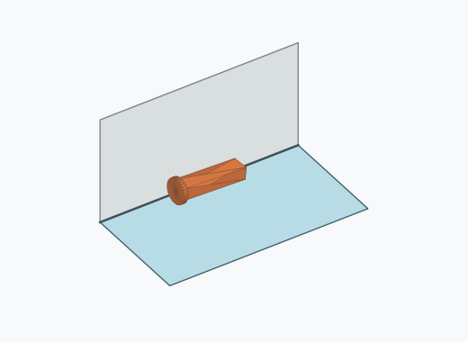
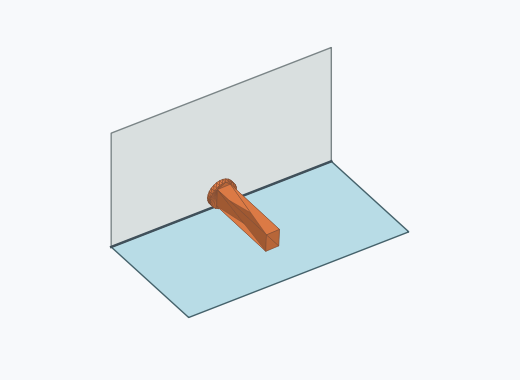
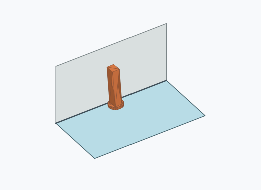
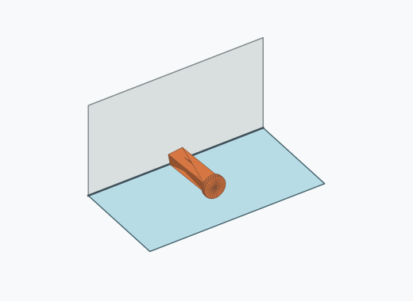
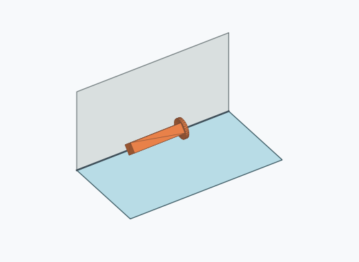
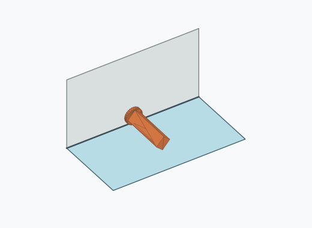
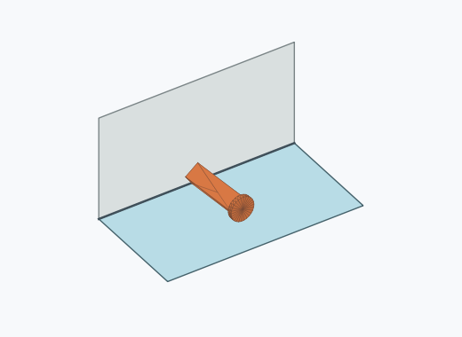

# Rl1a

1000 Fallversuche auf 500 mm Strecke; 981 eingependelte Endlagen. Prozentangaben beziehen sich auf alle Fallversuche.

Dies sind beobachtete Simulationslagen unter den dokumentierten Parametern; Reibung und Unebenheitsmodell sind noch nicht an realen Häufigkeiten kalibriert.

| Pose | Bild | Anzahl | Anteil | 95-%-Intervall | Anteil eingependelt |
| --- | --- | ---: | ---: | ---: | ---: |
| Rl1a_0006 |  | 250 | 25.00 % | 22.42–27.78 % | 25.48 % |
| Rl1a_0007 |  | 227 | 22.70 % | 20.21–25.40 % | 23.14 % |
| Rl1a_0011 |  | 218 | 21.80 % | 19.35–24.46 % | 22.22 % |
| Rl1a_0012 |  | 212 | 21.20 % | 18.78–23.84 % | 21.61 % |
| Rl1a_0005 |  | 30 | 3.00 % | 2.11–4.25 % | 3.06 % |
| Rl1a_0001 |  | 16 | 1.60 % | 0.99–2.58 % | 1.63 % |
| Rl1a_0010 |  | 7 | 0.70 % | 0.34–1.44 % | 0.71 % |
| Rl1a_0014 |  | 7 | 0.70 % | 0.34–1.44 % | 0.71 % |
| Rl1a_0015 |  | 4 | 0.40 % | 0.16–1.02 % | 0.41 % |
| Rl1a_0002 |  | 3 | 0.30 % | 0.10–0.88 % | 0.31 % |
| Rl1a_0003 |  | 2 | 0.20 % | 0.05–0.73 % | 0.20 % |
| Rl1a_0004 |  | 2 | 0.20 % | 0.05–0.73 % | 0.20 % |
| Rl1a_0008 |  | 1 | 0.10 % | 0.02–0.56 % | 0.10 % |
| Rl1a_0009 |  | 1 | 0.10 % | 0.02–0.56 % | 0.10 % |
| Rl1a_0013 |  | 1 | 0.10 % | 0.02–0.56 % | 0.10 % |

Ergebnisstatus: settled: 981, unsettled: 19

Details und Erkennung: [JSON](poses.json), [YAML](poses.yaml). Quaternionen: xyzw, Bauteil → Rutsche. Symmetrieoperationen werden rechts an die Bauteilrotation multipliziert. Die kontinuierliche Symmetrieachse wird gerichtet verglichen. Orientierungsabstand ≤5°; bei konkurrierenden Treffern innerhalb 1° bleibt die Zuordnung mehrdeutig.

Die Pose-IDs bleiben über Läufe erhalten. Der Registereintrag einer früher beobachteten, aktuell nicht aufgetretenen Pose bleibt zur Wiedererkennung reserviert.
