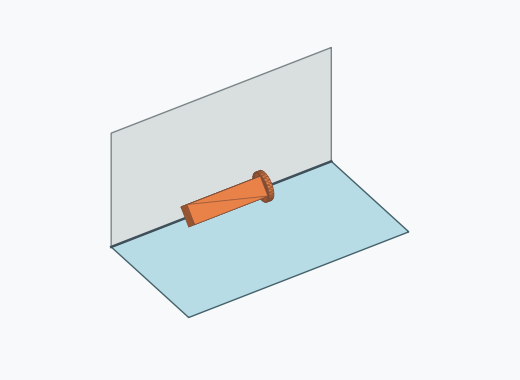
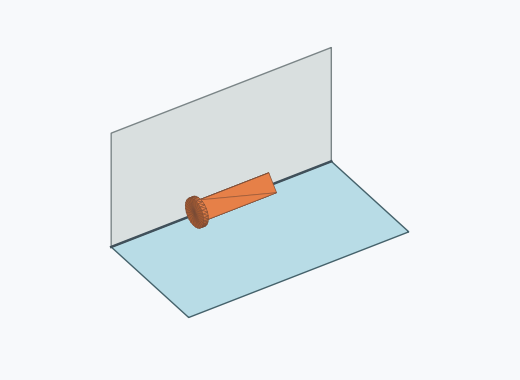
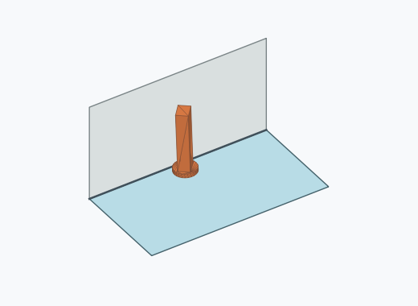
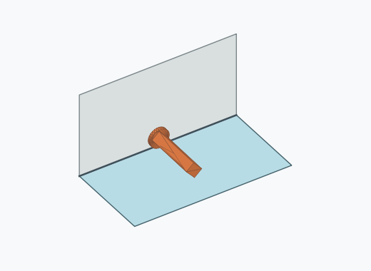
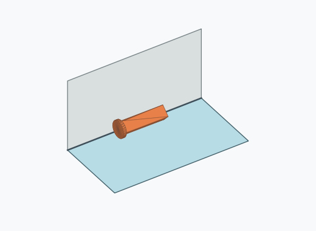
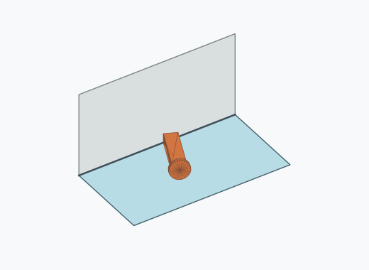
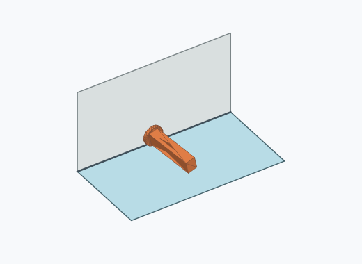
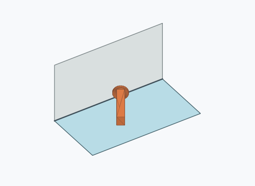

# Rl1a

10000 Fallversuche auf 500 mm Strecke; 9830 eingependelte Endlagen. Prozentangaben beziehen sich auf alle Fallversuche.

Dies sind beobachtete Simulationslagen unter den dokumentierten Parametern; Reibung und Unebenheitsmodell sind noch nicht an realen Häufigkeiten kalibriert.

| Pose | Bild | Anzahl | Anteil | 95-%-Intervall | Anteil eingependelt |
| --- | --- | ---: | ---: | ---: | ---: |
| Rl1a_0006 |  | 2462 | 24.62 % | 23.79–25.47 % | 25.05 % |
| Rl1a_0012 |  | 2234 | 22.34 % | 21.53–23.17 % | 22.73 % |
| Rl1a_0007 |  | 2221 | 22.21 % | 21.41–23.04 % | 22.59 % |
| Rl1a_0011 |  | 2156 | 21.56 % | 20.76–22.38 % | 21.93 % |
| Rl1a_0005 |  | 259 | 2.59 % | 2.30–2.92 % | 2.63 % |
| Rl1a_0001 |  | 167 | 1.67 % | 1.44–1.94 % | 1.70 % |
| Rl1a_0014 |  | 87 | 0.87 % | 0.71–1.07 % | 0.89 % |
| Rl1a_0015 |  | 62 | 0.62 % | 0.48–0.79 % | 0.63 % |
| Rl1a_0010 |  | 48 | 0.48 % | 0.36–0.64 % | 0.49 % |
| Rl1a_0004 |  | 19 | 0.19 % | 0.12–0.30 % | 0.19 % |
| Rl1a_0002 |  | 18 | 0.18 % | 0.11–0.28 % | 0.18 % |
| Rl1a_0023 |  | 16 | 0.16 % | 0.10–0.26 % | 0.16 % |
| Rl1a_0024 |  | 16 | 0.16 % | 0.10–0.26 % | 0.16 % |
| Rl1a_0008 |  | 11 | 0.11 % | 0.06–0.20 % | 0.11 % |
| Rl1a_0018 |  | 9 | 0.09 % | 0.05–0.17 % | 0.09 % |
| Rl1a_0003 |  | 7 | 0.07 % | 0.03–0.14 % | 0.07 % |
| Rl1a_0016 |  | 6 | 0.06 % | 0.03–0.13 % | 0.06 % |
| Rl1a_0027 |  | 5 | 0.05 % | 0.02–0.12 % | 0.05 % |
| Rl1a_0009 |  | 4 | 0.04 % | 0.02–0.10 % | 0.04 % |
| Rl1a_0029 |  | 4 | 0.04 % | 0.02–0.10 % | 0.04 % |
| Rl1a_0020 |  | 3 | 0.03 % | 0.01–0.09 % | 0.03 % |
| Rl1a_0026 |  | 3 | 0.03 % | 0.01–0.09 % | 0.03 % |
| Rl1a_0028 |  | 3 | 0.03 % | 0.01–0.09 % | 0.03 % |
| Rl1a_0021 |  | 2 | 0.02 % | 0.01–0.07 % | 0.02 % |
| Rl1a_0022 |  | 2 | 0.02 % | 0.01–0.07 % | 0.02 % |
| Rl1a_0030 |  | 2 | 0.02 % | 0.01–0.07 % | 0.02 % |
| Rl1a_0013 |  | 1 | 0.01 % | 0.00–0.06 % | 0.01 % |
| Rl1a_0017 |  | 1 | 0.01 % | 0.00–0.06 % | 0.01 % |
| Rl1a_0019 |  | 1 | 0.01 % | 0.00–0.06 % | 0.01 % |
| Rl1a_0025 |  | 1 | 0.01 % | 0.00–0.06 % | 0.01 % |

Ergebnisstatus: settled: 9830, unsettled: 170

Details und Erkennung: [JSON](poses.json), [YAML](poses.yaml). Quaternionen: xyzw, Bauteil → Rutsche. Symmetrieoperationen werden rechts an die Bauteilrotation multipliziert. Die kontinuierliche Symmetrieachse wird gerichtet verglichen. Orientierungsabstand ≤5°; bei konkurrierenden Treffern innerhalb 1° bleibt die Zuordnung mehrdeutig.

Die Pose-IDs bleiben über Läufe erhalten. Der Registereintrag einer früher beobachteten, aktuell nicht aufgetretenen Pose bleibt zur Wiedererkennung reserviert.
