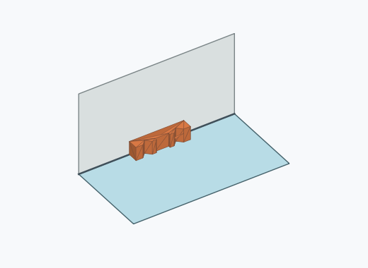
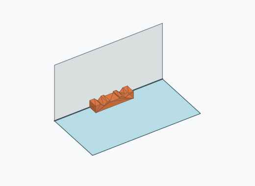
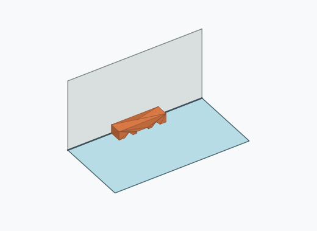
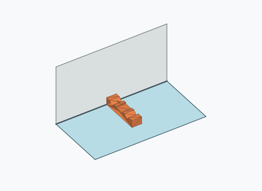
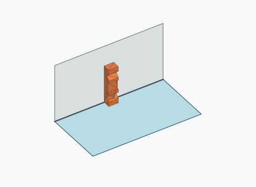
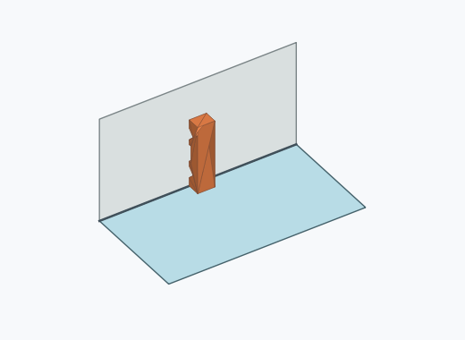

# Rl2i

1000 Fallversuche auf 500 mm Strecke; 1000 eingependelte Endlagen. Prozentangaben beziehen sich auf alle Fallversuche.

Dies sind beobachtete Simulationslagen unter den dokumentierten Parametern; Reibung und Unebenheitsmodell sind noch nicht an realen Häufigkeiten kalibriert.

| Pose | Bild | Anzahl | Anteil | 95-%-Intervall | Anteil eingependelt |
| --- | --- | ---: | ---: | ---: | ---: |
| Rl2i_0007 |  | 273 | 27.30 % | 24.63–30.14 % | 27.30 % |
| Rl2i_0001 |  | 259 | 25.90 % | 23.28–28.70 % | 25.90 % |
| Rl2i_0002 |  | 214 | 21.40 % | 18.97–24.05 % | 21.40 % |
| Rl2i_0006 |  | 214 | 21.40 % | 18.97–24.05 % | 21.40 % |
| Rl2i_0005 |  | 19 | 1.90 % | 1.22–2.95 % | 1.90 % |
| Rl2i_0008 |  | 13 | 1.30 % | 0.76–2.21 % | 1.30 % |
| Rl2i_0004 |  | 5 | 0.50 % | 0.21–1.17 % | 0.50 % |
| Rl2i_0003 |  | 2 | 0.20 % | 0.05–0.73 % | 0.20 % |
| Rl2i_0009 |  | 1 | 0.10 % | 0.02–0.56 % | 0.10 % |

Ergebnisstatus: settled: 1000

Details und Erkennung: [JSON](poses.json), [YAML](poses.yaml). Quaternionen: xyzw, Bauteil → Rutsche. Symmetrieoperationen werden rechts an die Bauteilrotation multipliziert. Die kontinuierliche Symmetrieachse wird gerichtet verglichen. Orientierungsabstand ≤5°; bei konkurrierenden Treffern innerhalb 1° bleibt die Zuordnung mehrdeutig.

Die Pose-IDs bleiben über Läufe erhalten. Der Registereintrag einer früher beobachteten, aktuell nicht aufgetretenen Pose bleibt zur Wiedererkennung reserviert.
