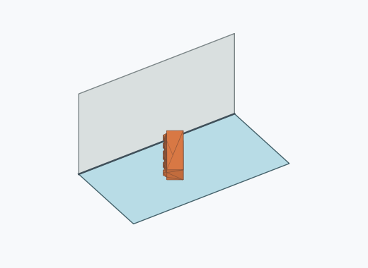
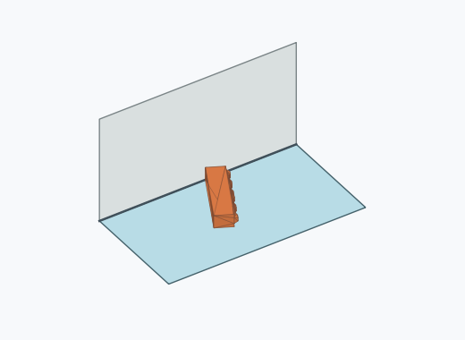
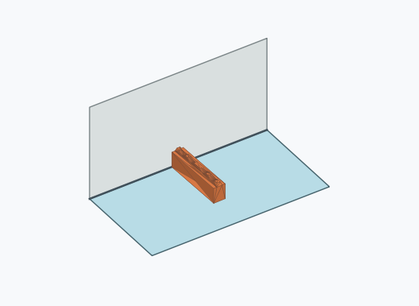

# Rl3a

10000 Fallversuche auf 500 mm Strecke; 9883 eingependelte Endlagen. Prozentangaben beziehen sich auf alle Fallversuche.

Dies sind beobachtete Simulationslagen unter den dokumentierten Parametern; Reibung und Unebenheitsmodell sind noch nicht an realen Häufigkeiten kalibriert.

| Pose | Bild | Anzahl | Anteil | 95-%-Intervall | Anteil eingependelt |
| --- | --- | ---: | ---: | ---: | ---: |
| Rl3a_0013 |  | 2507 | 25.07 % | 24.23–25.93 % | 25.37 % |
| Rl3a_0011 |  | 2350 | 23.50 % | 22.68–24.34 % | 23.78 % |
| Rl3a_0009 |  | 2172 | 21.72 % | 20.92–22.54 % | 21.98 % |
| Rl3a_0002 |  | 1742 | 17.42 % | 16.69–18.18 % | 17.63 % |
| Rl3a_0016 |  | 227 | 2.27 % | 2.00–2.58 % | 2.30 % |
| Rl3a_0007 |  | 197 | 1.97 % | 1.72–2.26 % | 1.99 % |
| Rl3a_0014 |  | 154 | 1.54 % | 1.32–1.80 % | 1.56 % |
| Rl3a_0006 |  | 151 | 1.51 % | 1.29–1.77 % | 1.53 % |
| Rl3a_0010 |  | 113 | 1.13 % | 0.94–1.36 % | 1.14 % |
| Rl3a_0004 |  | 109 | 1.09 % | 0.90–1.31 % | 1.10 % |
| Rl3a_0001 |  | 54 | 0.54 % | 0.41–0.70 % | 0.55 % |
| Rl3a_0003 |  | 46 | 0.46 % | 0.35–0.61 % | 0.47 % |
| Rl3a_0012 |  | 28 | 0.28 % | 0.19–0.40 % | 0.28 % |
| Rl3a_0005 |  | 24 | 0.24 % | 0.16–0.36 % | 0.24 % |
| Rl3a_0015 |  | 4 | 0.04 % | 0.02–0.10 % | 0.04 % |
| Rl3a_0017 |  | 2 | 0.02 % | 0.01–0.07 % | 0.02 % |
| Rl3a_0018 |  | 2 | 0.02 % | 0.01–0.07 % | 0.02 % |
| Rl3a_0019 |  | 1 | 0.01 % | 0.00–0.06 % | 0.01 % |

Ergebnisstatus: settled: 9883, unsettled: 117

Details und Erkennung: [JSON](poses.json), [YAML](poses.yaml). Quaternionen: xyzw, Bauteil → Rutsche. Symmetrieoperationen werden rechts an die Bauteilrotation multipliziert. Die kontinuierliche Symmetrieachse wird gerichtet verglichen. Orientierungsabstand ≤5°; bei konkurrierenden Treffern innerhalb 1° bleibt die Zuordnung mehrdeutig.

Die Pose-IDs bleiben über Läufe erhalten. Der Registereintrag einer früher beobachteten, aktuell nicht aufgetretenen Pose bleibt zur Wiedererkennung reserviert.
