# Rl3a

1000 Fallversuche auf 500 mm Strecke; 988 eingependelte Endlagen. Prozentangaben beziehen sich auf alle Fallversuche.

Dies sind beobachtete Simulationslagen unter den dokumentierten Parametern; Reibung und Unebenheitsmodell sind noch nicht an realen Häufigkeiten kalibriert.

| Pose | Bild | Anzahl | Anteil | 95-%-Intervall | Anteil eingependelt |
| --- | --- | ---: | ---: | ---: | ---: |
| Rl3a_0009 | 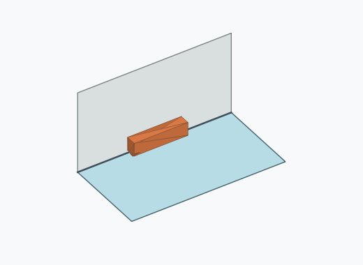 | 244 | 24.40 % | 21.84–27.16 % | 24.70 % |
| Rl3a_0011 | 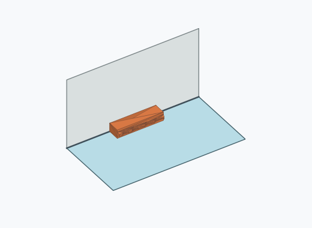 | 224 | 22.40 % | 19.92–25.09 % | 22.67 % |
| Rl3a_0013 | 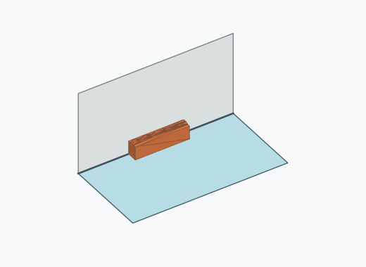 | 201 | 20.10 % | 17.73–22.70 % | 20.34 % |
| Rl3a_0002 | 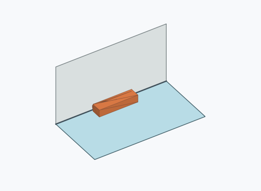 | 190 | 19.00 % | 16.69–21.55 % | 19.23 % |
| Rl3a_0008 |  | 30 | 3.00 % | 2.11–4.25 % | 3.04 % |
| Rl3a_0004 | 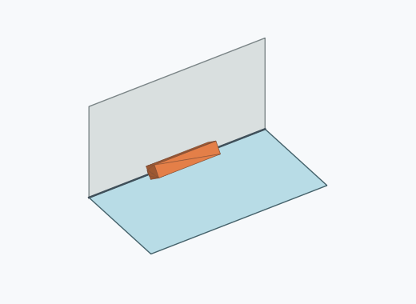 | 21 | 2.10 % | 1.38–3.19 % | 2.13 % |
| Rl3a_0006 |  | 17 | 1.70 % | 1.06–2.71 % | 1.72 % |
| Rl3a_0007 | 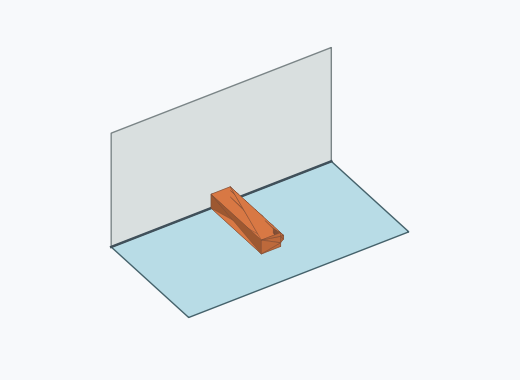 | 17 | 1.70 % | 1.06–2.71 % | 1.72 % |
| Rl3a_0010 | 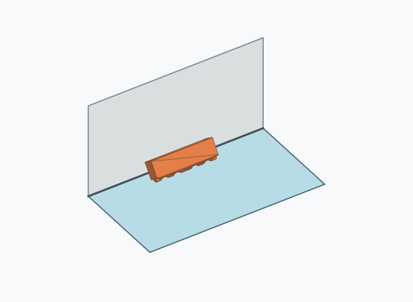 | 11 | 1.10 % | 0.62–1.96 % | 1.11 % |
| Rl3a_0001 | 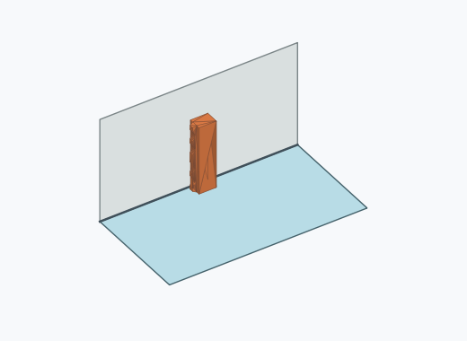 | 10 | 1.00 % | 0.54–1.83 % | 1.01 % |
| Rl3a_0014 | 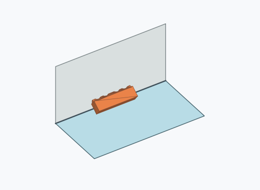 | 10 | 1.00 % | 0.54–1.83 % | 1.01 % |
| Rl3a_0003 | 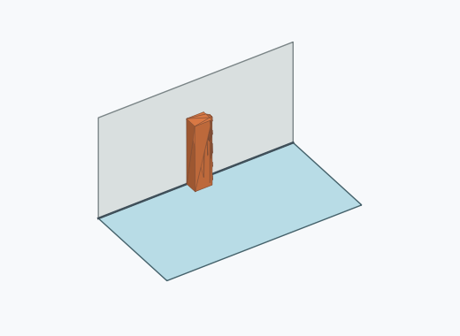 | 5 | 0.50 % | 0.21–1.17 % | 0.51 % |
| Rl3a_0005 |  | 5 | 0.50 % | 0.21–1.17 % | 0.51 % |
| Rl3a_0012 | 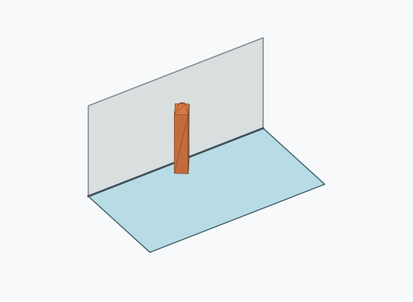 | 3 | 0.30 % | 0.10–0.88 % | 0.30 % |

Ergebnisstatus: settled: 988, unsettled: 12

Details und Erkennung: [JSON](poses.json), [YAML](poses.yaml). Quaternionen: xyzw, Bauteil → Rutsche. Symmetrieoperationen werden rechts an die Bauteilrotation multipliziert. Die kontinuierliche Symmetrieachse wird gerichtet verglichen. Orientierungsabstand ≤5°; bei konkurrierenden Treffern innerhalb 1° bleibt die Zuordnung mehrdeutig.

Die Pose-IDs bleiben über Läufe erhalten. Der Registereintrag einer früher beobachteten, aktuell nicht aufgetretenen Pose bleibt zur Wiedererkennung reserviert.
