# Rl4i

1000 Fallversuche auf 500 mm Strecke; 1000 eingependelte Endlagen. Prozentangaben beziehen sich auf alle Fallversuche.

Dies sind beobachtete Simulationslagen unter den dokumentierten Parametern; Reibung und Unebenheitsmodell sind noch nicht an realen Häufigkeiten kalibriert.

| Pose | Bild | Anzahl | Anteil | 95-%-Intervall | Anteil eingependelt |
| --- | --- | ---: | ---: | ---: | ---: |
| Rl4i_0004 | 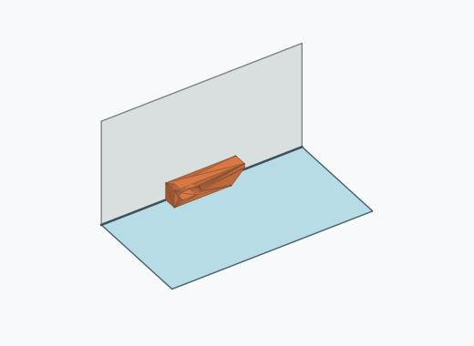 | 173 | 17.30 % | 15.08–19.77 % | 17.30 % |
| Rl4i_0001 | 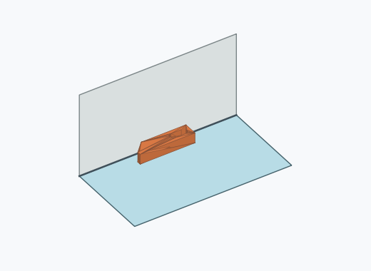 | 151 | 15.10 % | 13.01–17.45 % | 15.10 % |
| Rl4i_0005 |  | 145 | 14.50 % | 12.45–16.82 % | 14.50 % |
| Rl4i_0002 | 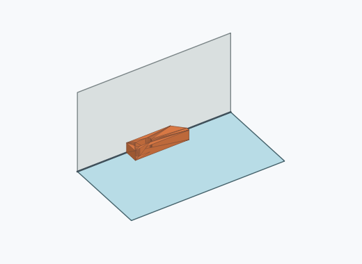 | 144 | 14.40 % | 12.36–16.71 % | 14.40 % |
| Rl4i_0007 | 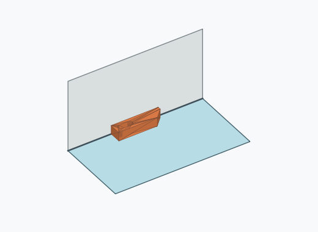 | 104 | 10.40 % | 8.66–12.45 % | 10.40 % |
| Rl4i_0008 |  | 96 | 9.60 % | 7.93–11.58 % | 9.60 % |
| Rl4i_0012 | 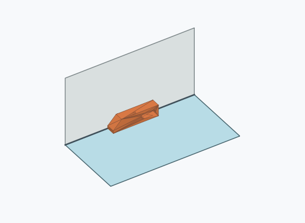 | 86 | 8.60 % | 7.02–10.50 % | 8.60 % |
| Rl4i_0014 | 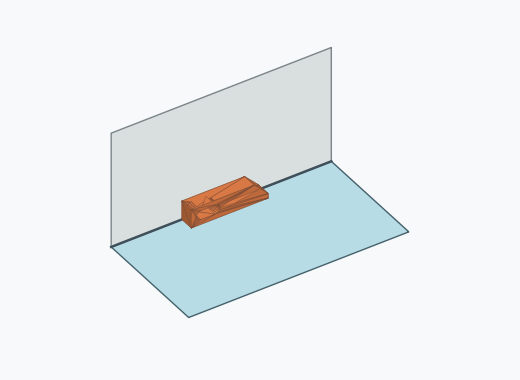 | 77 | 7.70 % | 6.20–9.52 % | 7.70 % |
| Rl4i_0013 | 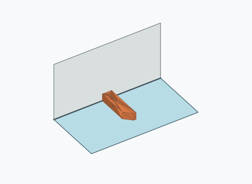 | 7 | 0.70 % | 0.34–1.44 % | 0.70 % |
| Rl4i_0015 | 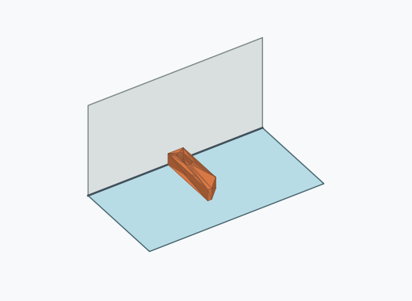 | 5 | 0.50 % | 0.21–1.17 % | 0.50 % |
| Rl4i_0009 | 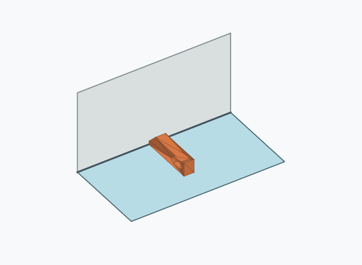 | 4 | 0.40 % | 0.16–1.02 % | 0.40 % |
| Rl4i_0016 | 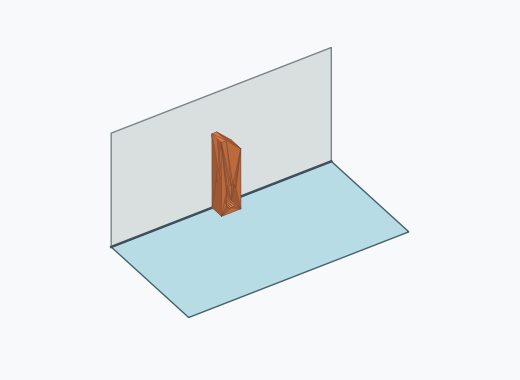 | 3 | 0.30 % | 0.10–0.88 % | 0.30 % |
| Rl4i_0006 | 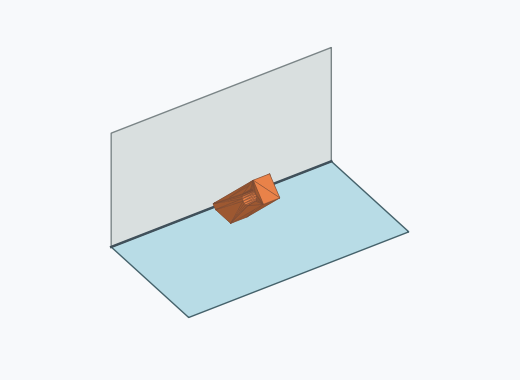 | 2 | 0.20 % | 0.05–0.73 % | 0.20 % |
| Rl4i_0003 |  | 1 | 0.10 % | 0.02–0.56 % | 0.10 % |
| Rl4i_0010 | 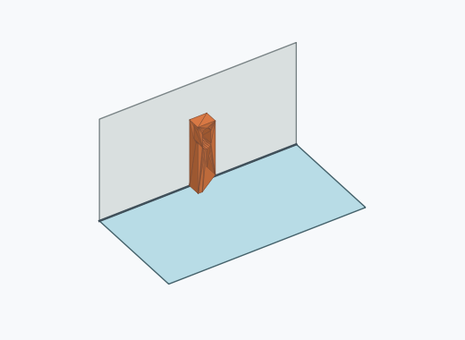 | 1 | 0.10 % | 0.02–0.56 % | 0.10 % |
| Rl4i_0011 | 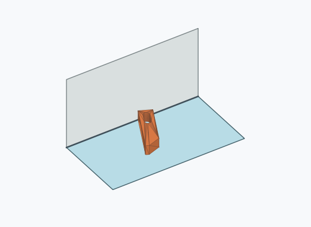 | 1 | 0.10 % | 0.02–0.56 % | 0.10 % |

Ergebnisstatus: settled: 1000

Details und Erkennung: [JSON](poses.json), [YAML](poses.yaml). Quaternionen: xyzw, Bauteil → Rutsche. Symmetrieoperationen werden rechts an die Bauteilrotation multipliziert. Die kontinuierliche Symmetrieachse wird gerichtet verglichen. Orientierungsabstand ≤5°; bei konkurrierenden Treffern innerhalb 1° bleibt die Zuordnung mehrdeutig.

Die Pose-IDs bleiben über Läufe erhalten. Der Registereintrag einer früher beobachteten, aktuell nicht aufgetretenen Pose bleibt zur Wiedererkennung reserviert.
