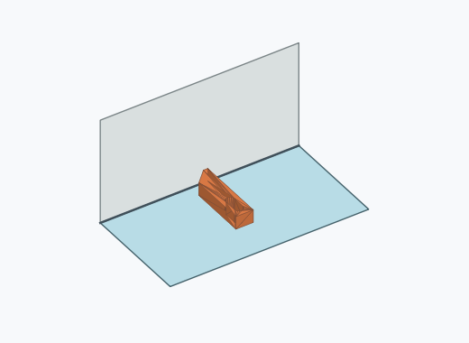
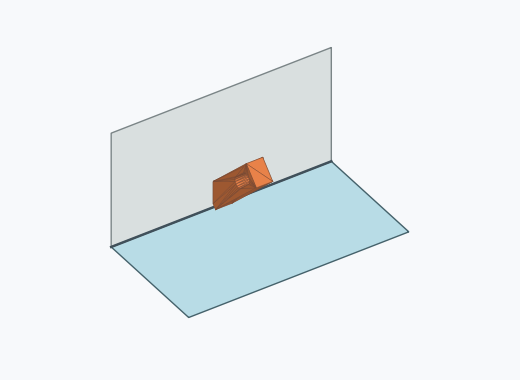
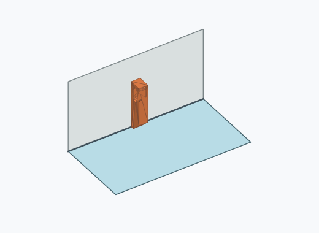

# Rl4i

10000 Fallversuche auf 500 mm Strecke; 9992 eingependelte Endlagen. Prozentangaben beziehen sich auf alle Fallversuche.

Dies sind beobachtete Simulationslagen unter den dokumentierten Parametern; Reibung und Unebenheitsmodell sind noch nicht an realen Häufigkeiten kalibriert.

| Pose | Bild | Anzahl | Anteil | 95-%-Intervall | Anteil eingependelt |
| --- | --- | ---: | ---: | ---: | ---: |
| Rl4i_0004 |  | 1476 | 14.76 % | 14.08–15.47 % | 14.77 % |
| Rl4i_0001 |  | 1424 | 14.24 % | 13.57–14.94 % | 14.25 % |
| Rl4i_0005 |  | 1404 | 14.04 % | 13.37–14.73 % | 14.05 % |
| Rl4i_0002 |  | 1362 | 13.62 % | 12.96–14.31 % | 13.63 % |
| Rl4i_0012 |  | 1040 | 10.40 % | 9.82–11.01 % | 10.41 % |
| Rl4i_0014 |  | 1037 | 10.37 % | 9.79–10.98 % | 10.38 % |
| Rl4i_0008 |  | 1027 | 10.27 % | 9.69–10.88 % | 10.28 % |
| Rl4i_0007 |  | 981 | 9.81 % | 9.24–10.41 % | 9.82 % |
| Rl4i_0015 |  | 87 | 0.87 % | 0.71–1.07 % | 0.87 % |
| Rl4i_0013 |  | 55 | 0.55 % | 0.42–0.72 % | 0.55 % |
| Rl4i_0009 |  | 27 | 0.27 % | 0.19–0.39 % | 0.27 % |
| Rl4i_0017 |  | 19 | 0.19 % | 0.12–0.30 % | 0.19 % |
| Rl4i_0003 |  | 17 | 0.17 % | 0.11–0.27 % | 0.17 % |
| Rl4i_0016 |  | 12 | 0.12 % | 0.07–0.21 % | 0.12 % |
| Rl4i_0006 |  | 10 | 0.10 % | 0.05–0.18 % | 0.10 % |
| Rl4i_0010 |  | 7 | 0.07 % | 0.03–0.14 % | 0.07 % |
| Rl4i_0018 |  | 3 | 0.03 % | 0.01–0.09 % | 0.03 % |
| Rl4i_0019 |  | 3 | 0.03 % | 0.01–0.09 % | 0.03 % |
| Rl4i_0011 |  | 1 | 0.01 % | 0.00–0.06 % | 0.01 % |

Ergebnisstatus: settled: 9992, unsettled: 8

Details und Erkennung: [JSON](poses.json), [YAML](poses.yaml). Quaternionen: xyzw, Bauteil → Rutsche. Symmetrieoperationen werden rechts an die Bauteilrotation multipliziert. Die kontinuierliche Symmetrieachse wird gerichtet verglichen. Orientierungsabstand ≤5°; bei konkurrierenden Treffern innerhalb 1° bleibt die Zuordnung mehrdeutig.

Die Pose-IDs bleiben über Läufe erhalten. Der Registereintrag einer früher beobachteten, aktuell nicht aufgetretenen Pose bleibt zur Wiedererkennung reserviert.
